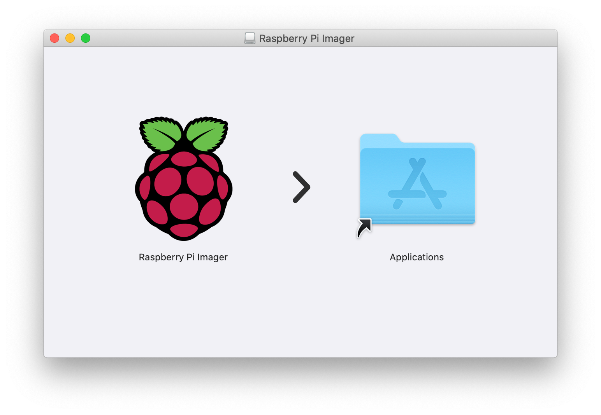
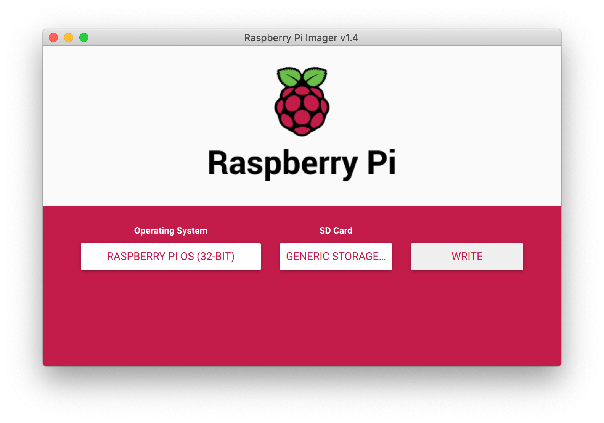
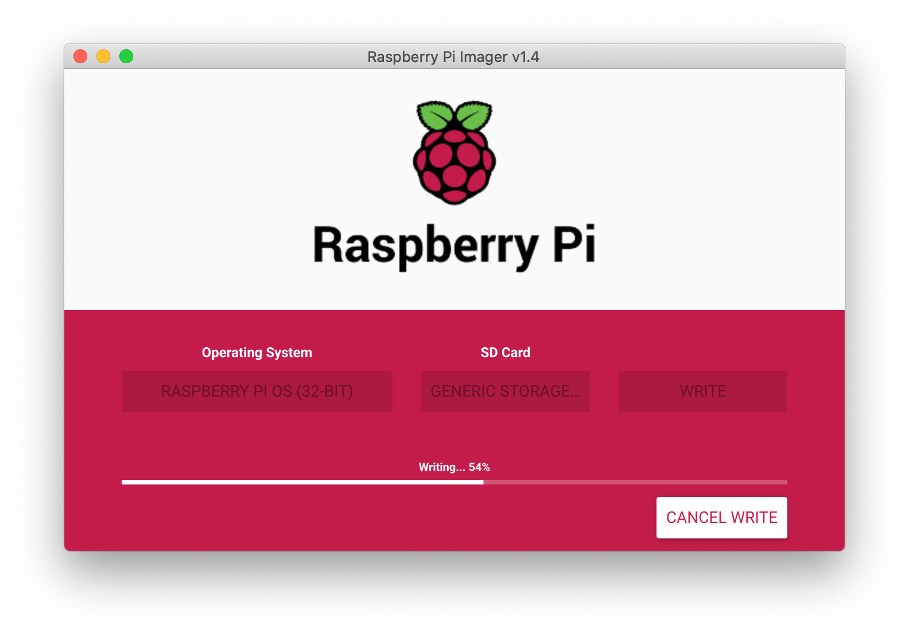
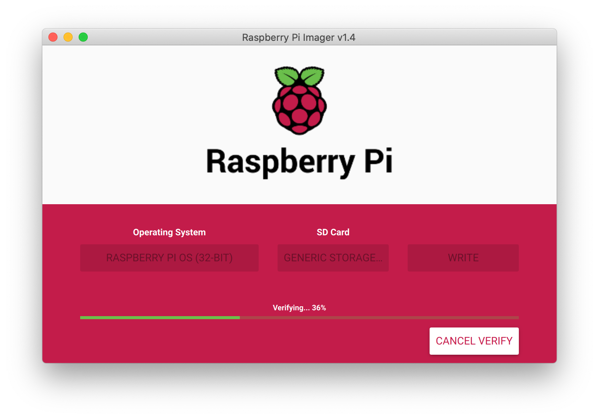
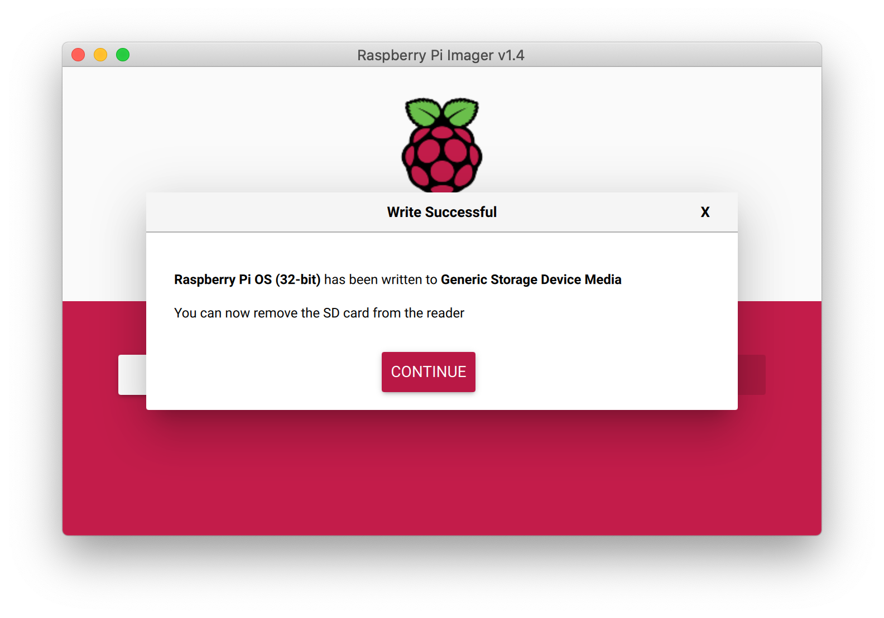

## Install Raspberry Pi OS using Raspberry Pi Imager

#### Download NOOBS
https://www.raspberrypi.org/software/

#### Install Raspberry Pi Imager in macOS


#### Write Raspberry Pi OS into SD Card using Raspberry Pi Imager
- Insert the SD card in your MacBookPro
- Open Raspberry Pi Imager.
- Select Raspberry Pi OS and SD Card, Click Write button to start writing OS in SD card. 

- Writing and Verifying...


- Remove the SD card from the reader after the Raspberry Pi OS is written to the SD card.


## Set up your Raspberry Pi
[Setting up your Raspberry Pi](https://projects.raspberrypi.org/en/projects/raspberry-pi-setting-up)

- Insert the microSD card into the card slot on the underside of the Raspberry Pi.
- Plug the USB keyboard into one of the USB ports.
- Plug the USB mouse into one of the USB ports
- Plug the HDMI or video component cable into the monitor or TV set. Turn on your monitor or TV set and make sure it is set to the proper input (e.g. HDMI 1 or Component)
- Connect USB WiFi Dongle or Ethernet Cable to the Raspberry Pi.
- Plug the power supply into the power outlet. This will turn on and boot up Raspberry Pi. 
- A start screen should appear on the monitor or TV you're using.
  - set up timezone
  - connect wifi network
  - upgrade OS

## SSH into your Raspberry Pi
- [Enable SSH](https://www.raspberrypi.org/documentation/remote-access/ssh/): Need reboot OS.
  - Raspberry Pi Configuration -> Interfaces -> SSH: Enable
  - Or Run `$ sudo raspi-config`. This also can be used to enable Camera.
- [Set up Static IP address](https://www.raspberrypi.org/documentation/configuration/tcpip/)
  - In your MBP, check your default Gateway IP of your local network.
    ```
    $ netstat -nr | grep default
     default            192.168.86.1       UGSc           en0
     default                                 fe80::%utun0                    UGcI          utun0
     default                                 fe80::%utun1                    UGcI          utun1
    ```
  - In your Raspberry Pi, modify `/etc/dhcpcd.conf` to set up static IP addresses at the bottom. wlan0 is wireless IP.
    ```
    pi@raspberrypi:~ $ nano /etc/dhcpcd.conf
    ...
    # fallback to static profile on eth0
    #interface eth0
    #fallback static_eth0
    
    interface eth0
    
    static ip_address=192.168.86.100/24
    static routers=192.168.86.1
    static domain_name_servers=192.168.86.1
    
    interface wlan0
    
    static ip_address=192.168.86.200/24
    static routers=192.168.86.1
    static domain_name_servers=192.168.86.1
    ...
    
    pi@raspberrypi:~ $ reboot
    ```
- In your Raspberry Pi, Check the IP address: Run `$ ping raspberrypi.local` in your Raspberry Pi.
- In your MBP, SSH into your pi from another computer. Default password is `raspberry`.
    ```
    ❯ ssh pi@192.168.86.200
    The authenticity of host '192.168.86.200 (192.168.86.200)' can't be established.
    ECDSA key fingerprint is SHA256:F6BlQO9PDGmyajljfTSYSZdxK4tMokqzngTfmFKU6LQ.
    Are you sure you want to continue connecting (yes/no/[fingerprint])? yes
    Warning: Permanently added '192.168.86.200' (ECDSA) to the list of known hosts.
    pi@192.168.86.200's password:
    Linux raspberrypi 5.4.79-v7+ #1373 SMP Mon Nov 23 13:22:33 GMT 2020 armv7l
    
    The programs included with the Debian GNU/Linux system are free software;
    the exact distribution terms for each program are described in the
    individual files in /usr/share/doc/*/copyright.
    
    Debian GNU/Linux comes with ABSOLUTELY NO WARRANTY, to the extent
    permitted by applicable law.
    Last login: Wed Dec  9 00:06:42 2020
    
    SSH is enabled and the default password for the 'pi' user has not been changed.
    This is a security risk - please login as the 'pi' user and type 'passwd' to set a new password.
    
    pi@raspberrypi:~ $
    ```
  
